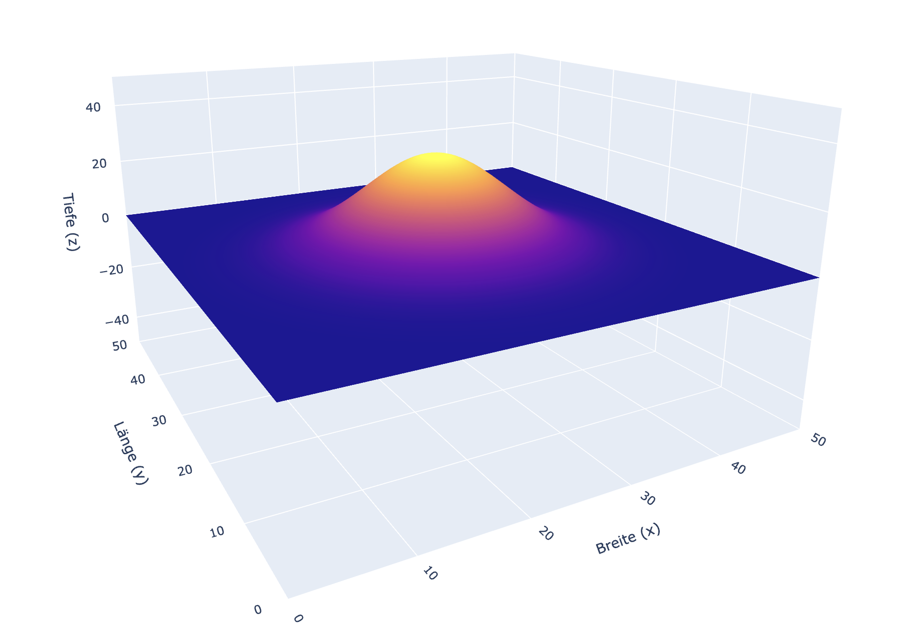
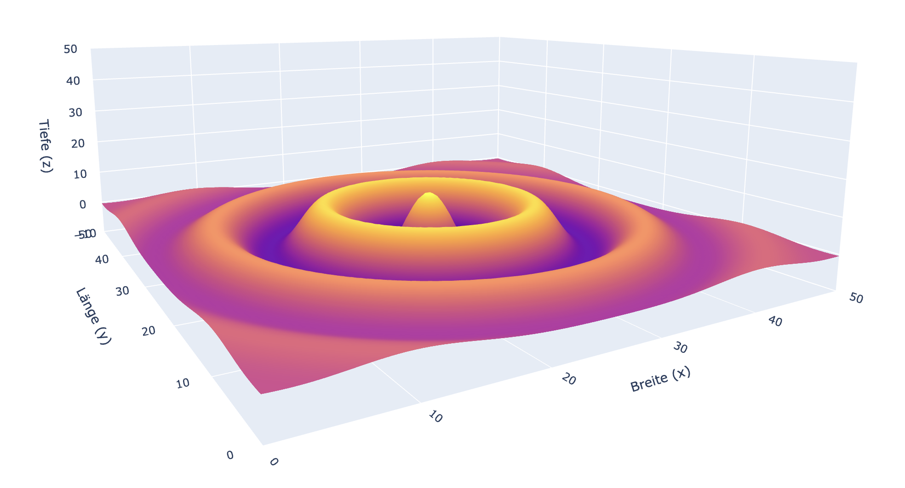

# cabFrontPlaner
This python script serves to model, visualize and compute the surface for a side table.

## Functions
### Bump
```python
front = graph(lengthX=50, lengthY=50, stepSize=0.5)
front.textures.add(bump(posX=25, posY=25, factorX=100, factorY=100, height=30))
front.plot()
```

### Rings
```python
front = graph(lengthX=50, lengthY=50, stepSize=0.5)
cover = bump(posX = 25, posY =  25, factorX = 400, factorY = 400, height = 1)
front.textures.add(rings(posX = 25, posY =  25, factorX = 40000, factorY = 40000, height = 10, cover=cover))
front.plot()
```
